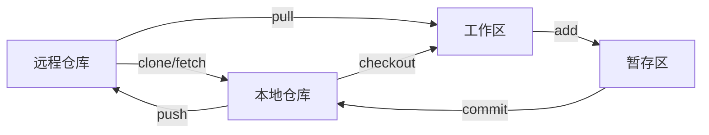

# Git :star:
## 工作流程

## 用户名和邮箱
```js
git config --global user.name "user_name"
git config --global user.email "user_name@mail"
```
## ssh
1. 在本地生成ssh密钥
```js
ssh-keygen -t ed25519 -C "user_name@mail"
```
2. 复制密钥内容
```js
 clip < ~/.ssh/id_ed25519.pub
```
3. 在GitHub上设置ssh
将第2步复制的密钥内容，粘贴到 `github->setting->SSH and GPG keys->New SSH keys` 的`Key`中，`Title`可以随便起。
## 创建仓库
创建仓库有两种方式，直接克隆仓库，或者新建一个仓库，并和远程仓库关联起来
1. clone
```js
git clone <url>
```
2. init
```js
git init
git remote add origin <url>
```
## 基本操作
### add
`git add`命令可将文件添加到暂存区
```js
// 将所有项目添加到暂存区
git add .
// 将目标文件(一个或多个，用空格隔开)添加到暂存区
git add [file1] [file2]
// 查看暂存区文件状态，A表示新添加的，M表示修改的
git status -s
```
### commit
`git commit`命令可以将暂存区的内容添加到本地仓库
```js
// 提交到本地仓库，带有信息
git commit -m "message"
// 提交指定文件到本地仓库
git commit [file1] [file2] -m "message"
// 直接提交，不需要git add命令
git commit -am "message"
```
### pull
### push
### fetch
## 分支