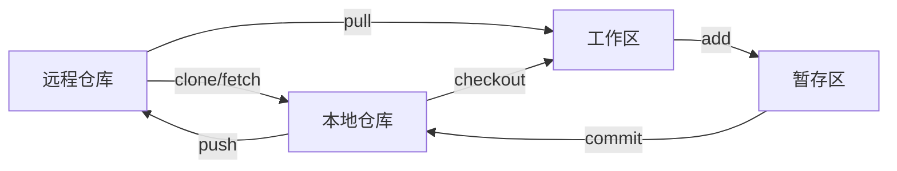

# Git :star:
## 工作流程

## 用户名和邮箱
```js
git config --global user.name "user_name"
git config --global user.email "user_name@mail"
```
## ssh
1. 在本地生成ssh密钥
```js
ssh-keygen -t ed25519 -C "user_name@mail"
```
2. 复制密钥内容
```js
 clip < ~/.ssh/id_ed25519.pub
```
3. 在GitHub上设置ssh
将第2步复制的密钥内容，粘贴到 `github->setting->SSH and GPG keys->New SSH keys` 的`Key`中，`Title`可以随便起。
## 创建仓库
创建仓库有两种方式，直接克隆仓库，或者新建一个仓库，并和远程仓库关联起来
1. clone
```js
git clone <url>
```
2. init
```js
git init
git remote add origin <url>
```
## 基本操作
### add
`git add`命令可将文件添加到暂存区
```js
// 将所有项目添加到暂存区
git add .
// 将目标文件(一个或多个，用空格隔开)添加到暂存区
git add [file1] [file2]
// 查看暂存区文件状态，A表示新添加的，M表示修改的
git status -s
```
### commit
`git commit`命令可以将暂存区的内容添加到本地仓库
```js
// 提交到本地仓库，带有信息
git commit -m "message"
// 提交指定文件到本地仓库
git commit [file1] [file2] -m "message"
// 直接提交，不需要git add命令
git commit -am "message"
```
### fetch
`git fetch`命令可以从远程仓库获取代码到本地，不会更改工作区的代码。
```js
// 获取指定分支
git fetch [远程仓库名] [分支名]
// 获取所有分支
git fetch --all
```
### pull
`git pull`命令可以从远程仓库获取代码并合并到本地
```js
git pull [远程仓库名] [远程分支名]:[本地分支名]
// 从远程仓库origin的master分支拉取过来，合并到本地branch分支
git pull origin master:branch
// 拉取远程仓库origin的master分支到当前本地分支
git pull origin master
// 简写为git pull相当于git fetch&&git merge
git pull
```
### push
`git push`命令用于上传本地分支版本到远程分支并合并。
```js
// 将代码上传到指定远程仓库的指定分支
git push [远程仓库名] [远程分支名]:[本地分支名]
// 如果远程分支和本地分支同名，则可以省略本地分支名
git push [远程仓库名] [远程分支名]
// 强制推送，忽略差异
git push -f origin master
// 删除远程分支
git push origin -d master
// 创建新的远程分支，并推送当前本地分支
git push --set-upstream origin master
// 简写形式
git push -u origin master
```
### status
`git status`命令可以查看上次提交后对文件再次修改的信息。
```js
// 显示详细的文件修改信息
git status
// 显示简化的文件修改信息
git status -s
```
### stash
`git stash`命令可以将暂存区的文件保存在栈中。
```js
// 将暂存区文件保存在栈中
git stash save 'message'
// 将栈中的文件取回
git stash pop
```
## 分支
分支分为本地分支和远程分支，通过分支指令做的大部分操作都是修改本地分支的信息，需要修改远程分支信息通过`push`指令。  
### 创建和切换
```js
// 创建本地分支
git branch [branchname] 
// 切换分支
git checkout [branchname]
// 创建并切换分支
git checkout -b [branchname]
```
### 查看分支
```js
// 列出本地分支
git branch -v
// 列出远程分支
git branch -r
// 列出所有分支
git branch -a
// 列出本地分支的跟踪信息
git branch -vv
```
### 操作分支
```js
// 删除本地已合并分支
git branch -d [branchname]
// 强制删除本地分支
git branch -D [branchname]
// 重命名分支
git branch -m [old-branch-name] [new-branch-name]
// 设置本地分支与远程分支的追踪
git branch -u origin/master master
// 将分支合并到当前分支
git merge [branchname]
// 例如把newbranch合并到master
git checkout master
git merge newbranch
```
## remote
`git remote`指令用操作远程仓库。
```js
// 添加一个远程仓库
git remote add [远程仓库别名] [远程仓库地址]
// 显示所有远程仓库
git remote -v
// 删除远程仓库
git remote rm [远程仓库别名]
// 重命名远程仓库
git remote rename [旧名字] [新名字]
```
## reset
`git remote`指令用于回退版本。
```js
// 回退内容到上一个版本
git reset HEAD^
// 回退某个文件到上一个版本
git reset HEAD^ [file]
// 回退到指定版本
git reset 052e
```
## alias
`git alias`指令用于设置指令别名。
```js
git config --global alias.[简化的字符] 原始命令
// 设置checkout指令为co
git config --global alias.co checkout
git co master
```